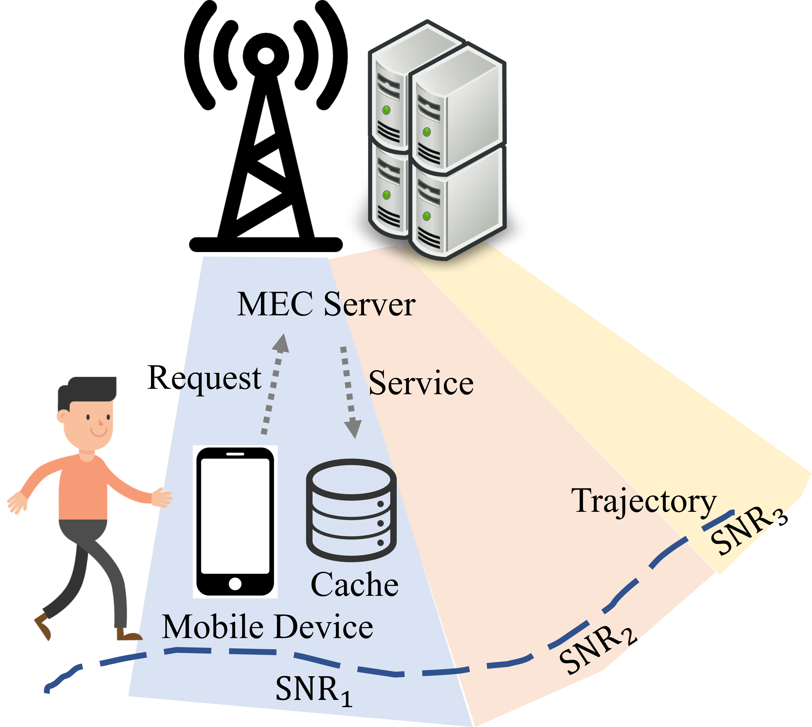

# Joint Computing, Pushing, and Caching Optimization for Mobile Edge Computing Networks via Soft Actor-Critic Learning
A Deep-Reinforcement Learning Approach for activity optimization in mobile edge computing (MEC) network.

<p align="center">  </p>

> [**Joint Computing, Pushing, and Caching Optimization for Mobile Edge Computing Networks Via Soft Actor-Critic Learning**](https://arxiv.org/pdf/2309.15369.pdf)            
> Xiangyu Gao, Yaping Sun, Hao Chen, Xiaodong Xu, and Shuguang Cui <br />
> *arXiv technical report ([arXiv 2309.15369](https://arxiv.org/abs/2309.15369))*
> 
    @ARTICLE{10275097, author={Gao, Xiangyu and Sun, Yaping and Chen, Hao and Xu, Xiaodong and Cui, Shuguang},
         journal={IEEE Internet of Things Journal}, 
         title={Joint Computing, Pushing, and Caching Optimization for Mobile Edge Computing Networks Via Soft Actor-Critic Learning}, 
         year={2023}, volume={}, number={}, pages={1-1}, 
         doi={10.1109/JIOT.2023.3323433}}

## Update
***(Dec. 3, 2023) Release the source code and sample data.***

## Abstract
Mobile edge computing (MEC) networks bring computing and storage capabilities closer to edge devices, which reduces latency and improves network performance. However, to further reduce transmission and computation costs while satisfying user-perceived quality of experience, a joint optimization in computing, pushing, and caching is needed. In this paper, we formulate the joint-design problem in MEC networks as an infinite-horizon discounted-cost Markov decision process and solve it using a deep reinforcement learning (DRL)-based framework that enables the dynamic orchestration of computing, pushing, and caching. Through the deep networks embedded in the DRL structure, our framework can implicitly predict user future requests and push or cache the appropriate content to effectively enhance system performance. One issue we encountered when considering three functions collectively is the curse of dimensionality for the action space. To address it, we relaxed the discrete action space into a continuous space and then adopted soft actor-critic learning to solve the optimization problem, followed by utilizing a vector quantization method to obtain the desired discrete action. Additionally, an action correction method was proposed to compress the action space further and accelerate the convergence. Our simulations under the setting of a general single-user, single-server MEC network with dynamic transmission link quality demonstrate that the proposed framework effectively decreases transmission bandwidth and computing cost by proactively pushing data on future demand to users and jointly optimizing the three functions. We also conduct extensive parameter tuning analysis, which shows that our approach outperforms the baselines under various parameter settings.

## Requirements
*   Python 3.6
*   Preferred system: Linux
*   Pytorch-1.5.1
*   Other packages (refer to [`requirement`](requirements.txt))


## Default Arguments and Usage
### System Configuration
The configurations are in [`config`](config.py) file. Note that the values of some parameters are limited to a few options because modifyting them needs the support of a *.csv* file in [`./data/`](./data) folder.

### Usage

```
usage: main.py [-h] [--env-name ENV_NAME] [--exp-case EXP_CASE] [--policy POLICY] 
               [--eval EVAL] [--gamma G] [--tau G] [--lr G] [--alpha G]
               [--automatic_entropy_tuning G] [--seed N] [--batch_size N]
               [--num_steps N] [--hidden_size N] [--updates_per_step N]
               [--start_steps N] [--target_update_interval N] [--replay_size N] 
               [--cuda]
```

Note: There is no need for setting Temperature(`--alpha`) if `--automatic_entropy_tuning` is True.

#### For Running proposed PTDFC Algorithm
* ***PTDFC***: Proactive Transmission and Dynamic-computing-Frequency reactive service with
Cache
```
python main.py --automatic_entropy_tuning True --target_update_interval 1000 --lr 1e-4 --exp-case case3 --cuda
```

#### For Running Baselines
Baselines:
* ***DFC***: Dynamic-computing-Frequency reactive service with Cache
* ***DFNC***: Dynamic-computing-Frequency reactive service with No Cache
* ***MFU-LFU***: Most-Frequently-Used proactive transmission and Least-Frequently-Used cache replacement
* ***MRU-LRU***: Most-Recently-Used proactive transmission and Least-Recently-Used cache replacement

Use the specific value for `--exp-case` argument

| Algorithms | `--exp-case` |
|------------|--------------|
| PTDFC      | case3        |
| DFC        | case4        |
| DFNC       | case2        |
| MFU-LFU    | case7        |
| MRU-LRU    | case6        |

#### For Visualizing Convergence Via Tensorboard
```
tensorboard --logdir=runs --host localhost --port 8088
```

#### Usage of Other Arguments

```
sac_joint_compute_push_cache Args

optional arguments:
  -h, --help            show this help message and exit
  --env-name ENV_NAME   Wireless Comm environment (default: MultiTaskCore)
  --exp-case EXP_CASE   Evaluation Algorithm (default: case3)
  --policy POLICY       Policy Type: Gaussian | Deterministic (default:
                        Gaussian)
  --eval EVAL           Evaluates a policy a policy every 10 episode (default:
                        True)
  --gamma G             discount factor for reward (default: 0.99)
  --tau G               target smoothing coefficient(τ) (default: 0.005)
  --lr G                learning rate (default: 3e-4)
  --alpha G             Temperature parameter α determines the relative
                        importance of the entropy term against the reward
                        (default: 0.2)
  --automatic_entropy_tuning G
                        Automaically adjust α (default: False)
  --seed N              random seed (default: 123456)
  --batch_size N        batch size (default: 256)
  --num_steps N         maximum number of steps (default: 5000001)
  --hidden_size N       hidden size (default: 256)
  --updates_per_step N  model updates per simulator step (default: 1)
  --start_steps N       Steps sampling random actions (default: 10000)
  --target_update_interval N
                        Value target update per no. of updates per step
                        (default: 1000)
  --replay_size N       size of replay buffer (default: 1000000)
  --cuda                run on CUDA (default: False)
```

## License

This codebase is released under MIT license (see [LICENSE](LICENSE)).

## Acknowledgement
This project is not possible without multiple great opensourced codebases. We list some notable examples below.  

* [pytorch-soft-actor-critic](https://github.com/pranz24/pytorch-soft-actor-critic)

## Contact
Contact *Xiangyu Gao* ([xygao@uw.edu](mailto:xygao@uw.edu)). Questions and suggestions are welcome.


